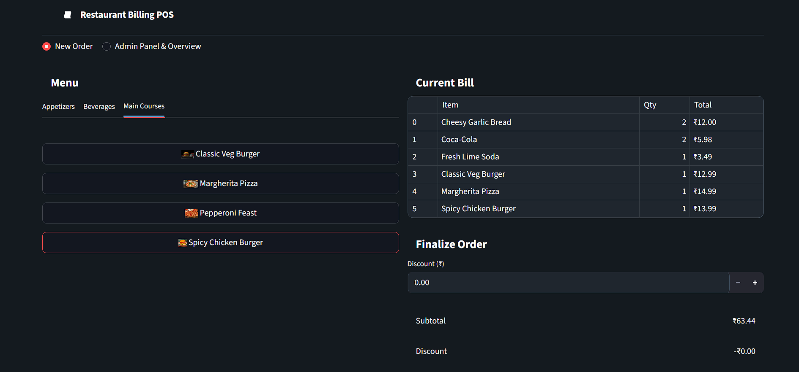
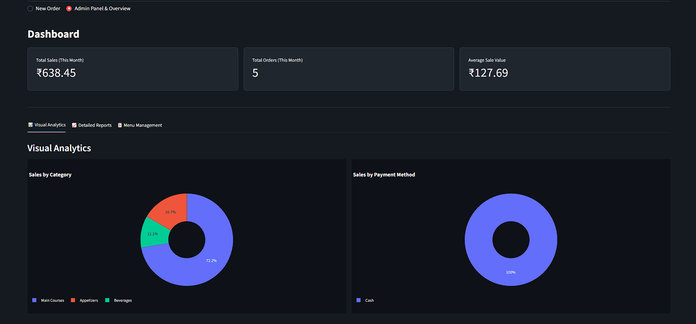
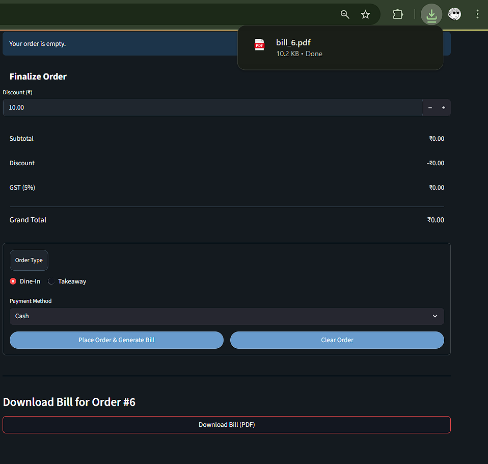

# Restaurant Billing POS

<p align="center">
  
  
  
</p>

Restaurant Billing POS is a modern, efficient Point of Sale (POS) system designed for restaurants. Built with Python and Streamlit, it features a sleek, light-themed web interface with a light pink background (#fdf2f2) and red accents (#e92933), inspired by a professional HTML design. The system provides seamless order management, real-time bill calculations, and insightful sales analytics.

---

### 📸 Live Preview / Screenshots

**New Order Page:**  


**Admin Panel with Interactive Charts:**  


**Generated PDF Invoice:**  


---

### ✨ Key Features

- **Modern Light-Themed UI**: Clean, responsive interface using the "Plus Jakarta Sans" font, with a light pink background and red accents.
- **Real-time Billing**: Instantly update bills with subtotal, 10% tax, discounts, and special requests as items are added.
- **Interactive Menu**: Tabbed menu organized by category, featuring 100x100px clickable item cards with images on the right.
- **PDF Bill Export**: Generate and download professional, itemized invoices for each order.
- **Comprehensive Admin Dashboard**:
  - Display key performance indicators (KPIs) such as total sales, total orders, and average sale value.
  - Visualize sales trends with interactive **pie charts** and **line graphs** powered by Plotly.
  - Filter reports by **Daily, Weekly, or Monthly** periods.
- **Easy Menu Management**: Upload a `menu.csv` file to the `data` folder to update the restaurant menu.
- **Flexible Data Storage**: Supports SQLite database for persistent storage and CSV-based menu management in the `data` folder.
- **Order Management**: Handle dine-in and takeaway orders with payment options (Cash, Card, UPI) and intuitive quantity controls.

---

### 🛠️ Tech Stack

- **Backend**: Python
- **Frontend / Web Framework**: Streamlit
- **Database**: SQLite3
- **Data Manipulation**: Pandas
- **Charting / Visualization**: Plotly Express
- **PDF Generation**: FPDF

---

### 📂 Folder Structure

The project is organized for modularity and maintainability:

```
Restaurant-Billing-POS/
├── app.py              # Main application launcher
├── requirements.txt    # Project dependencies
├── ui/
│   └── main_ui.py      # Streamlit UI code with light-themed design
├── utils/
│   ├── db_utils.py     # Database and CSV interactions
│   ├── calculator.py   # Billing calculations
│   └── pdf_generator.py # PDF bill generation
├── data/
│   └── menu.csv        # Menu data in CSV format
├── assets/
│   └── images/         # Menu item images (e.g., Margherita Pizza.jpg)
└── db/
    └── restaurant.db   # SQLite database (auto-created)
```

---

### 🚀 Getting Started

Follow these steps to set up and run Restaurant Billing POS on your local machine.

#### 1. Prerequisites
- Ensure **Python 3.9** or newer is installed.

#### 2. Clone the Repository
```bash
git clone https://github.com/VP7985/Restaurant-Billing-POS.git
cd Restaurant-Billing-POS
```

*(Note: Replace `VP7985` with your actual GitHub username.)*

#### 3. Create a `requirements.txt` File
Create a file named `requirements.txt` in the project root with the following content:

```txt
streamlit
pandas
plotly
fpdf
```

#### 4. Install Dependencies
Run the following command to install required libraries:

```bash
pip install -r requirements.txt
```

#### 5. Set Up the `data` and `assets` Folders
- Create a `data` folder in the project root and add a `menu.csv` file with the following structure:
  ```csv
  id,name,price,category,image_path
  1,Cheesy Garlic Bread,8.50,Appetizers,assets/images/Cheesy Garlic Bread.jpg
  2,Margherita Pizza,18.00,Main Courses,assets/images/Margherita Pizza.jpg
  3,Calamari,12.00,Appetizers,assets/images/Calamari.jpg
  4,Steak,25.50,Main Courses,assets/images/Steak.jpg
  ```
- Create an `assets/images` folder and place menu item images (e.g., `Cheesy Garlic Bread.jpg`) referenced in `menu.csv`.

#### 6. Run the Application
Launch the Streamlit server:

```bash
streamlit run app.py
```

Your browser will open to the application at `http://localhost:8501`.


---

### 👨‍💻 Developed By

**Your Name**

- **GitHub**: [https://github.com/VP7985](https://github.com/VP7985)


---
